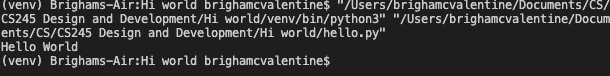

# hello-world
first repository on GitHub

# description

A program that prints "hello world"

# development environment

* visual studio code
* python 3.7.3

# how to execute environment-

To execute the program `python hello.py`

# useful websites

[instruction video](https://video.byui.edu/media/0_v2afnpby)
